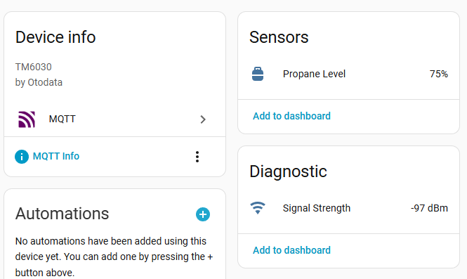

# Home Assistant MQTT publisher for the Otodata TM6030 Propane Tank Fuel Monitor via Bluetooth LE

This project provides a Python-based bridge that listens for **Otodata Propane Tank Monitors** (such as the TM6030) via Bluetooth Low Energy (BLE) and publishes the data to **Home Assistant** via MQTT.

## 🚀 Features

- **Zero-Config Discovery**: Automatically finds and creates sensors for any Otodata tank in range.
- **Precision Tracking**: Parses the "Friendly Name" broadcast for high-accuracy level data.
- **Availability Monitoring**: Marks sensors as "Unavailable" in Home Assistant if the bridge goes down.

## 🛠️ Installation

```bash
python3 -m virtualenv venv
./venv/bin/pip install -r requirements.txt
```

### Manual

```bash
MQTT_BROKER="192.168.1.50" MQTT_USER="home" MQTT_PASS="pass" ./venv/bin/python monitor.py
```

### systemd

Place the following at `/etc/systemd/system/otodata-bridge.service`:

```ini
[Unit]
Description=Otodata Propane BLE to MQTT Bridge
After=network.target bluetooth.target
Requires=bluetooth.target

[Service]
Type=simple
User=root
WorkingDirectory=/home/someone/ha-otodata
ExecStart=/home/someone/ha-otodata/venv/bin/python /home/someone/ha-otodata/monitor.py

Environment="MQTT_BROKER=homeassistant.lan"
Environment="MQTT_PORT=1883"
Environment="MQTT_USER=otodata"
Environment="MQTT_PASS=your_password"
Environment="BRIDGE_TOPIC=otodata/bridge/status"

Restart=always
RestartSec=10

[Install]
WantedBy=multi-user.target
```

and run:

```bash
sudo systemctl daemon-reload
sudo systemctl enable otodata-bridge.service
sudo systemctl start otodata-bridge.service
```

logs:

```bash
journalctl -u otodata-bridge.service
```

## Home Assistant

To find the device, Settings > Devices & Services.

Under the MQTT Integration, you will see a new device: "Propane Tank [Serial Number]".

It should look like this:


